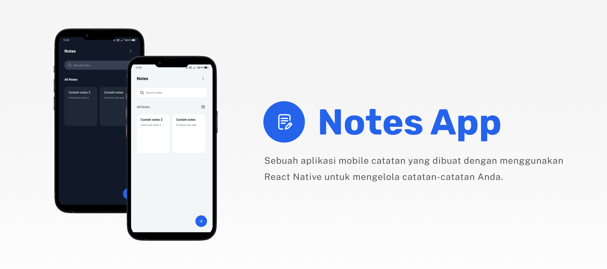

# Notes App


## Deskripsi
Sebuah aplikasi catatan yang dibuat dengan menggunakan React Native yang berguna untuk mengelola catatan-catatan dengan mudah dan efisien.

## Fitur-fitur
- Membuat Catatan
- Mengedit Catatan
- Menghapus Catatan
- Pengarsipan Catatan
- Dark Mode
- Ubah Bahasa (ID/EN)

## Teknologi yang digunakan
- [React Native](https://reactnative.dev)
- [Expo](https://expo.dev)
- [Redux](https://redux.js.org) / [Redux Toolkit](https://redux-toolkit.js.org)
- [React Native Async Storage](https://react-native-async-storage.github.io/async-storage/docs/install/)
- [React Navigation](https://reactnavigation.org/)
- [React Native Radio Button](https://www.npmjs.com/package/react-native-simple-radio-button)

## Instalasi
1. Clone repository
```
git clone https://github.com/rezakurniawan88/notes-react-native.git
```
2. Install dependencies
```
npm install
```
3. Jalankan codenya
```
npm start
```
4. Scan QR Code
```
Install Expo Go di Playstore/Appstore, lalu scan QR Code nya dengan Expo Go
```

## Download
Download Aplikasinya disini [Notes App](https://github.com/rezakurniawan88/notes-react-native/releases/download/v1.0.0/Notes.App.v.1.0.0.apk)